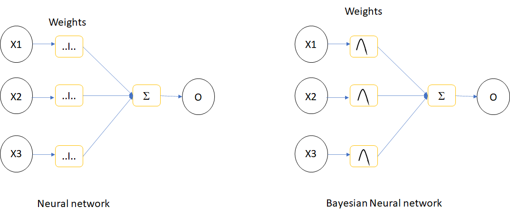
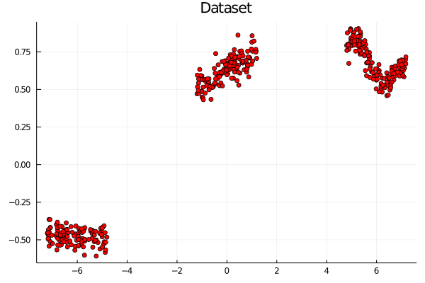
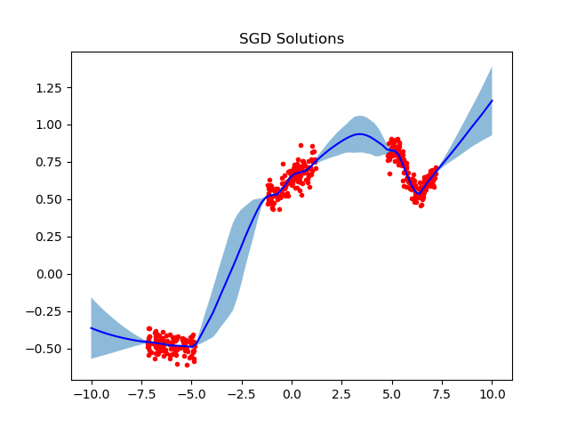
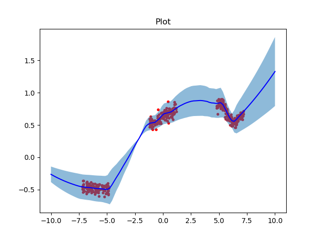
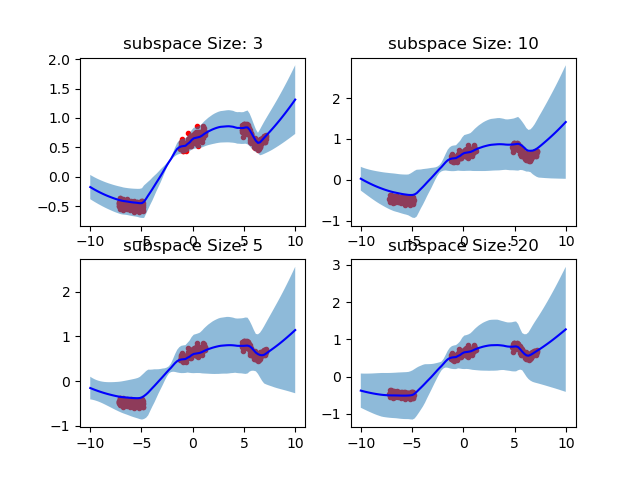
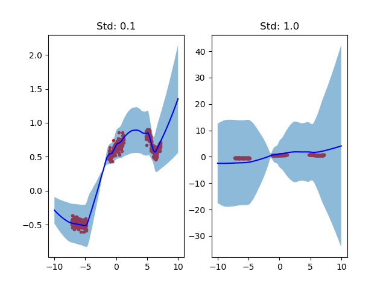

---

# Subspace Inference Based Uncertainty Analysis for Deep Neural Networks 

A non-linear system is generally modelled by using many methods , among them machine learning is the best method.
In machine learning based system modelling, the machine learning algorithm generates model from known dataset called  as training data so that the system can predict output for any given input data. There are different models used in machine learning systems, Artificial neural networks (ANN) is a prominent method used in machine learning. and this method mimics biological neural networks. Similar to the real neuron, ANN model contains artificial neurons with parameters, this parameters are adjusted during training or learning process
based on sample data for prediction.

The Deep Neural Networks (DNN)  belongs to broader category of ANN with more hidden layers to extract more features from the training data which is capable to tackle more and more complex and challenging problems. During the  training, all parameters of DNN will be updated based on loss function, the trained DNN will be able to predict output similar to actual output for a certain input. However, the different DNN  training identifies slightly various DNN parameters for same scenarios, which results in causes uncertainty in the prediction.


The uncertainty in DNN is can be generated using Bayesian inference and it helps to identify the parameter values, that generated likelihood prediction to the actual output. 
This identification of uncertainties in deep learning models are called as Bayesian Neural Networks (BNN).


$$
P(A|B) = \frac{P(B|A)*P(A))}{P(B)}
$$

Bayesian inference is a method of statistical inference in which Bayes’ theorem is used to update the probability for a posterior hypothesis as more evidence or information becomes available. Bayes inference derives posterior probability from the prior probability distributions and  from the  likelihood function that represents the system model. Bayesian inference computes the posterior probability  from the above given equation. In this equation the posterior probability  `P(A|B)` is proportional to the product of prior and the likelihood probability distribution. `P(A|B)` and `P(B|A)` is also called as conditional probability and `P(A)` and `P(B)` is called marginal probability. The calculation of `P(B)` is tedious process, therefore, approximate Bayesian inference is introduced. In approximate Bayesian inference, the posterior probability will be proportional to the product of prior probability distribution and the likelihood distribution. Similarly, the prior probability will be proportional to joint probability. The Markov Chain
Monte Carlo (MCMC) methods or sing variational inference methods (VI) are used to sample the posterior distribution by considering the joint probability distribution.
 The [Turing.jl](https://github.com/TuringLang/Turing.jl) package in Julia supports Bayesian inference using MCMC methods like MH, HMC and NUTS, also this package supports ADVI inference too. The other packages like [AdvancedMH.jl](https://github.com/TuringLang/AdvancedMH.jl) and [AdvanceHMC.jl](https://github.com/TuringLang/AdvancedHMC.jl) are capable to generate  posterior samples using Metropolis Hastings and Hamiltonian Monte Carlo algorithm, respectively. Moreover, these algorithms can take input from user defined probability density functions for Bayesian inference. The Bayesian inference generates parameter samples within the uncertainty distribution and it is possible to identify the distribution of sample using statistical methods. The BNN parameters as a distribution is illustrated in figure below:



The drawback on BNN is the time to generate the inference, when  the number of parameters in the neural networks (NN )increases, the uncertainty generation of NN parameters using Bayesian concept become more expensive in terms of time.

Subspace inference method introduced to reduce the inference time in BNN by constructing a smaller subspace of actual NN Parameter space. This subspace is generated from the  principle  components of the deviation matrix of weight updation during training.

### Subspace Inference Algorithm

The subspace inference uses a pretrained DNN and it is implemented using following steps

1. Generate low dimensional subspace
2. Execute Bayesian inference within this subspace
3. Transform posterior of lower dimensional subspace to original dimension

#### Algorithm for subspace construction
The subspace of NN model parameters are constructed by following steps:
1. Initialize mean parameters to pretrained parameter value, $W_{swa} = W_0$
2. For every epoch $i$ 
    2.1 Update parameter using SGD
    2.2 Update mean parameters as  $Wswa = (n*W_{swa} + \frac{W_{i}}{n+1})$, where $n = i/f$. $f$ is the weight update frequency
    2.3 Calculate parameter deviation, $W_{d} = W_{i}-W_{swa}$
3. Do principle component analysis
4. Generate projection matrix

### Improvements in Subspace Inference
The subspace inference implementation by [Izamailov](https://arxiv.org/abs/1907.07504) consider the deviations of last $M$ (rank of PCA) columns. We have modified this algorithm by considering all deviation matrix during subspace construction to get more information about the subspace. Moreover, in [Izamailov](https://arxiv.org/abs/1907.07504)'s work, the posterior of subspace is updated based on the prior distribution of subspace only. We modified to generate subspace samples based on weight distribution. The prior distribution is defined as function,  and it takes the  subspace as the input  and  throws NN parameters prior distribution as output which is defined in the below pseudo function:

```
function prior(z)
    W = Wswa + Pz
    return Normal(W,1.0)
end
```

The advanced MH and HMC algorithms help to take prior distribution as functions instead of distribution.

The subspace inference method for NN is implemented as a package named [SubspaceInference.jl](https://github.com/efmanu/SubspaceInference.jl) in Julia and it can be installed as below:

<<eval=false>>=
using Pkg
Pkg.add("https://github.com/efmanu/SubspaceInference.jl")
@


### Example for subspace inference for DNN
To implement this example, we use a multilayer perceptron with two input and one output  and three hidden layers. This example uses the data and the model from [python implementation](https://github.com/wjmaddox/drbayes). 

The example implementation is started with using some packages.

<<eval=false>>=
using NPZ
using Plots
using Flux
using Flux: Data.DataLoader
using Flux: @epochs
using Plots
using BSON: @save
using BSON: @load
using Zygote
using Statistics
using Revise
using SubspaceInference;
@

The sample data is loaded from `.npy` file and contains two columns, one is taken as $x$ and other as $y$. The $x$ is converted to features using features function. Then zipped using DataLoader available with Flux and is plotted here.

<<eval=false>>=
data_ld = npzread("data.npy");
x, y = (data_ld[:, 1]', data_ld[:, 2]');
function features(x)
    return vcat(x./2, (x./2).^2)
end

f = features(x);
data =  DataLoader(f,y, batchsize=50, shuffle=true);

#plot data
scatter(data_ld[:,1],data_ld[:,2],color=["red"], title="Dataset", legend=false)
@



### DNN Model setup
The simple multilayer perceptron is created as using Dense layer. This DNN contains 2 inputs, 1 output and hidden layers of $[200,50,50]$ size. All layers other than the output layer contains the ReLu activation function.

<<eval=false>>=
m = Chain(
    Dense(2,200,Flux.relu), 
    Dense(200,50,Flux.relu),
    Dense(50,50,Flux.relu),
    Dense(50,50,Flux.relu),
    Dense(50,1),
);

θ, re = Flux.destructure(m);

L(x, y) = Flux.Losses.mse(m(x), y)/2;

ps = Flux.params(m);

opt = Momentum(0.01, 0.95);
callback() = @show(L(X,Y)) #callback function
epochs = 3000
for j in 1:5
   m = Chain(
           Dense(2,200,Flux.relu),
           Dense(200,50,Flux.relu),
           Dense(50,50,Flux.relu),
           Dense(50,50,Flux.relu),
           Dense(50,1),
   )
   ps = Flux.params(m)
   @epochs 1 Flux.train!(L, ps, data_ld, opt, cb = () -> callback()) 
   @save "model_weights_$(j).bson" ps
end
@

This SGD solutions are used as the standard to compare the uncertainties generated by using subspace inference

<<eval=false>>=
z = collect(range(-10.0, 10.0,length = 100))
inp = features(z')
trajectories = Array{Float64}(undef,100,5)
for i in 1:5
	@load "model_weights_$(i).bson" ps
	Flux.loadparams!(m, ps)
	out = m(inp)
	trajectories[:, i] = out'
end
all_trj = Dict()
all_trj["1"] = trajectories
SubspaceInference.plot_predictive(data_ld, all_trj, z, title=["SGD Solutions"])
@



### Subspace Inference
The subspace inference uses pretrained model to generate the uncertainty informations. 

<<eval = false>>=
i = 1;
@load "model_weights_$(i).bson" ps;
Flux.loadparams!(m, ps);

M = 5 #Rank of PCA or Maximum columns in deviation matrix
T = 1 #Steps
itr = 100
all_chain, lp, W_swa = subspace_inference(m, L, data, opt,
	σ_z = 0.1,	itr =itr, T=T, c=1, M=M, print_freq=T, alg =:rwmh);


z = collect(range(-10.0, 10.0,length = 100))
inp = features(z')
trajectories = Array{Float64}(undef,100,itr)
for i in 1:itr
	m1 = re(all_chain[i])
	out = m1(inp)
	trajectories[:, i] = out'
end
all_trajectories = Dict()
all_trajectories["1"] = trajectories;

SubspaceInference.plot_predictive(data_ld, all_trajectories, title=["Plot"], z)
@



### Effect of comparison of different subspace sizes
This simulation considers subspace size of 3,5 and 10.

<<eval=false>>=
M = [3, 5, 10, 20] #Rank of PCA or Maximum columns in deviation matrix
T = 5 #Steps
itr = 100
all_trajectories = Dict()
z = collect(range(-10.0, 10.0,length = 100))
inp = features(z')
for mi in 1:4
    i = 1;
    @load "model_weights_$(i).bson" ps;
    Flux.loadparams!(m, ps);
    all_chain, lp, W_swa = subspace_inference(m, L, data, opt,
	σ_z = 1.0,	itr =itr, T=T, c=1, M=M[mi], print_freq=T, alg =:rwmh);    
    
    trajectories = Array{Float64}(undef,100,itr)
    for i in 1:itr
        m1 = re(all_chain[i])
        out = m1(inp)
        trajectories[:, i] = out'
    end
    all_trajectories["$(mi)"] = trajectories;
end
title = ["subspace Size: 3","subspace Size: 5","subspace Size: 10","subspace Size: 20"]

SubspaceInference.plot_predictive(data_ld, all_trajectories, z, title=title)
@



### Effect of comparison of different proposal deviations
This simulation considers proposal deviations of `0.1` and `1.0`.

<<eval=false>>=
M = 10 #Rank of PCA or Maximum columns in deviation matrix
T = 5 #Steps
itr = 100
all_trajectories = Dict()
z = collect(range(-10.0, 10.0,length = 100))
inp = features(z')
σ_z = [0.1, 1.0]
for mi in 1:2
    i = 1;
    @load "model_weights_$(i).bson" ps;
    Flux.loadparams!(m, ps);
    all_chain, lp, W_swa = subspace_inference(m, L, data, opt,
	σ_z = σ_z[mi],	itr =itr, T=T, c=1, M=M, print_freq=T, alg =:rwmh);    
    
    trajectories = Array{Float64}(undef,100,itr)
    for i in 1:itr
        m1 = re(all_chain[i])
        out = m1(inp)
        trajectories[:, i] = out'
    end
    all_trajectories["$(mi)"] = trajectories;
end
title = ["Std: 0.1", "Std: 1.0"]

SubspaceInference.plot_predictive(data_ld, all_trajectories, z, title=title)
@



### Diffusion Map based subspace Construction
The subspace is constructed in above experiments by using dimensionality reduction techniques named Principle Component Analysis(PCA). This method is simple to implement however, it fails with many real-world datasets have non-linear characteristics. Therefore diffusion map is introduced in subspace construction to consider the non-linearity in dimensionality reduction.


### Autoencoder based subspace construction
Similar to diffusion maps, autoencoder is also a dimensionality reduction method that accounts nonlinearity in neural ODE parameters. Moreover, this technique is  based on machine learning. 
