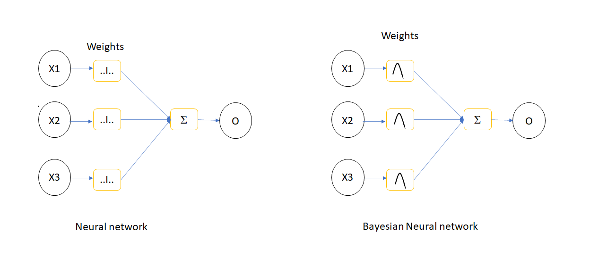
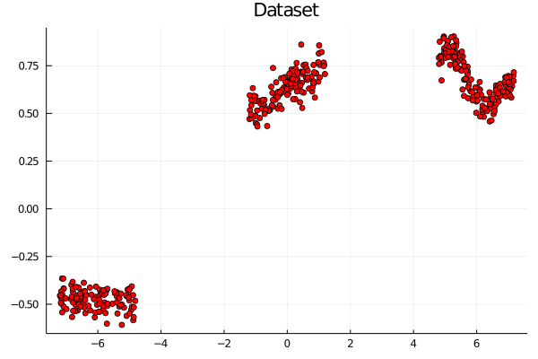
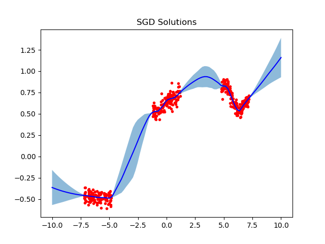
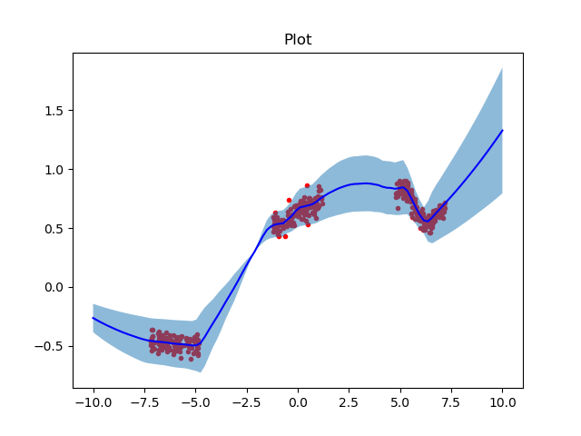
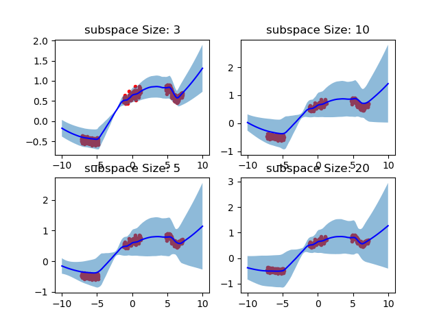
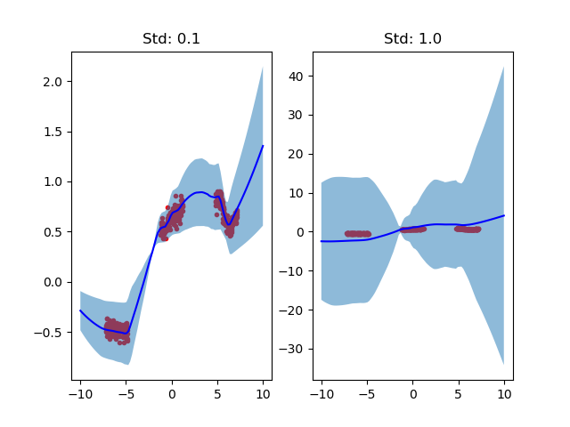

# Subspace Inference Based Uncertainty Analysis for Deep Neural Networks 

### Bayes' Rule

Bayes rule is a mathematical formula used to calculate the conditional probability of an event based on prior knowledge about the conditions that is related to the event. Bayes' rule is expressed as:

``P(A|B) = \frac{P(B|A)*P(A))}{P(B)}``

Where,
 - `P(A|B)`: Conditional probability of event `A` occurring given `B` and also known as posterior and it is the updated belief about an event.
 - `P(B|A)`: Conditional probability of event `B` occurring given `A`, known as likelihood
 - `P(A)`  : Probability of event A, known as prior and it is the belief about the event.
 - `P(B)`  : Probability of event B, known as evidence

The [Wikipedia page](https://en.wikipedia.org/wiki/Bayes%27_theorem) clearly describes Bayes' rule with examples.


### Bayesian Inference
The Bayesian inference depends on Bayes' rule to update belief regarding a probability of an event to occur based on available observations and evidences. According to the book [Statistical Rethinking](https://books.google.com.au/books?hl=en&lr=&id=6H_WDwAAQBAJ&oi=fnd&pg=PT8&dq=statistical+rethinking+mcelreath&ots=WhkgJHxQWl&sig=La0bfuicltYRLmx7MpmwOuA17cc&redir_esc=y#v=onepage&q=statistical%20rethinking%20mcelreath&f=false), Bayesian inference uses Bayes' rule to quantify the uncertainty in model and parameters. [Markov Chain  Monte Carlo Techniques (MCMC)](https://jvanderw.une.edu.au/L11introMCMC.pdf) and [variational inference (VI)](https://stanford.edu/~jgrimmer/VariationalFinal.pdf) are used for Bayesian inference.

### Julia packages for Bayesian inference

[Turing.jl](https://github.com/TuringLang/Turing.jl), [AdvancedMH.jl](https://github.com/TuringLang/AdvancedMH.jl), [AdvancedHMC.jl](https://github.com/TuringLang/AdvancedHMC.jl), [Soss.jl](https://github.com/cscherrer/Soss.jl), [Stan.jl](https://github.com/StanJulia/Stan.jl) are common packages provides Bayesian inference facility. [Turing.jl](https://github.com/TuringLang/Turing.jl) contains MH, HMC, NUTS etc based MCMC sampler and variational inference based samplers too. Howeverm [AdvancedMH.jl](https://github.com/TuringLang/AdvancedMH.jl) or [AdvancedHMC.jl](https://github.com/TuringLang/AdvancedHMC.jl) only allows Bayesian inference with MH and HMC respectively. However, these algorithms can take input from user defined probability density functions for Bayesian inference.

### Bayesian Neural Networks



The Deep Neural Networks (DNN)  belongs to broader category of ANN with more hidden layers to extract more features from the training data which is capable to tackle more and more complex and challenging problems. However, there will be some  uncertainty in DNN parameters and it can be generated by using Bayesian inference. This technique is called as [Bayesian Neural Networks(BNN)](https://arxiv.org/pdf/1505.05424.pdf) and this method uses MCMC and VI methods for uncertainty generation. The drawback on BNN is the time to generate the inference, when  the number of parameters in the neural networks (NN )increases, the uncertainty generation of NN parameters using Bayesian concept become more expensive in terms of time.

### Subspace Inference
[Subspace inference](https://arxiv.org/abs/1907.07504) method introduced to reduce the inference time in BNN by constructing a smaller subspace of actual NN Parameter space. This subspace is generated from the  principle  components of the deviation matrix of weight updation during training.

### Subspace Inference Algorithm

The subspace inference uses a pretrained DNN and it is implemented using following steps

1. Generate low dimensional subspace
2. Execute Bayesian inference within this subspace
3. Transform posterior of lower dimensional subspace to original dimension

#### Algorithm for subspace construction
The subspace of NN model parameters are constructed by following steps:
1. Initialize mean parameters to pretrained parameter value, $W_{swa} = W_0$
2. For every epoch $i$ 
    2.1 Update parameter using SGD
    2.2 Update mean parameters as  ``Wswa = (n*W_{swa} + \frac{W_{i}}{n+1})$, where $n = i/f``. ``f`` is the weight update frequency
    2.3 Calculate parameter deviation, ``W_{d} = W_{i}-W_{swa}``
3. Do principle component analysis
4. Generate projection matrix

#### Algorithm for subspace inference
1. Define proposal distribution of subspace
2. Define prior distribution of subspace
3. Define likelihood function, here it is a neural network
4. Sample subspace values using MCMC or VI samplers.


### SubspaceInference.jl Julia package

The subspace inference method for DNN and ordinary differential equations (ODEs) are implemented as a package named [SubspaceInference.jl](https://github.com/efmanu/SubspaceInference.jl) in Julia.  The subspace inference implementation by [Izamailov](https://arxiv.org/abs/1907.07504) consider the deviations of last $M$ (rank of PCA) columns. We have modified this algorithm by considering all deviation matrix during subspace construction to get more information about the subspace. Moreover, in [Izamailov](https://arxiv.org/abs/1907.07504)'s work, the posterior of subspace is updated based on the prior distribution of subspace only. We modified to generate subspace samples based on weight distribution. The prior distribution is defined as function,  and it takes the  subspace as the input  and  throws NN parameters prior distribution as output which is defined in the below pseudo function:

```julia
function prior(z)
    W = Wswa + Pz
    return Normal(W,1.0)
end
```

The advanced MH and HMC algorithms help to take prior distribution as functions instead of distribution. The [SubspaceInference.jl](https://github.com/efmanu/SubspaceInference.jl) can be installed in Julia as:

```julia
using Pkg
Pkg.add("https://github.com/efmanu/SubspaceInference.jl")
```

### Example of subspace inference with SubspaceInference.jl

Implementation of subspace inference for a multilayer perceptron with two input and one output  and three hidden layers is discussed in this section by referring [python implementation](https://github.com/wjmaddox/drbayes) using the dataset from there. The example implementation is started with using some packages.

```julia
using NPZ,Plots
using Flux, Flux: Data.DataLoader, Flux: @epochs
using BSON: @save, @load
using Zygote, Statistics, SubspaceInference;
```
The sample data is loaded from `.npy` file found in [python implementation](https://github.com/wjmaddox/drbayes).  This data contains two columns and each columns named as ``x`` and  ``y`` respectively. The ``x`` is converted to features using features function. The feature function returns a matrix ``f`` with two columns. One column will be the ``x/2`` and the other column will be ``(\frac{x}{2})^2``. 

```julia
data_ld = npzread("data.npy");
x, y = (data_ld[:, 1]', data_ld[:, 2]');
function features(x)
    return vcat(x./2, (x./2).^2)
end
f = features(x);
```

The input data ``f`` and the output $y$ zipped as `50` batches and shuffled using DataLoader available with Flux. The ``y`` from dataset is plotted against ``x`` as in the below figure.

```julia
data =  DataLoader(f,y, batchsize=50, shuffle=true);
#plot data
scatter(data_ld[:,1],data_ld[:,2],color=["red"], title="Dataset", legend=true)

```



A simple multilayer perceptron is created as using Dense layer for implementing subspace inference example. This DNN contains 2 inputs, 1 output and hidden layers of ``[200,50,50]`` size. All layers other than the output layer contains the `ReLu` activation function.

```julia
m = Chain(
    Dense(2,200,Flux.relu), 
    Dense(200,50,Flux.relu),
    Dense(50,50,Flux.relu),
    Dense(50,50,Flux.relu),
    Dense(50,1),
);

```
The mean squared error between input and output data is used as the loss function.

```julia
L(x, y) = Flux.Losses.mse(m(x), y)/2;
```
The Stochastic Gradient Descent(SGD) optimizer with learning rate of  `0.01` and momentum of `0.95` is used for updating parameters during DNN training.

```julia
opt = Momentum(0.01, 0.95);
```
The intialized parameters of DNN is extracted as below:
```julia
ps = Flux.params(m);
```
The callback function prints the loss for every training batch.
```julia
callback() = @show(L(X,Y)) 
```

The initialized DNN is trained for 3000 epochs using `Flux.train!` function.
```julia
@epochs 3000 Flux.train!(L, ps, data_ld, opt, cb = () -> callback())
```
Also, the DNN is trained `5` different iterations to plot the SGD solutions. The trained network  is saved after the training using `BSON` package for future use.

```julia
epochs = 3000
for j in 1:5
   m = Chain(
           Dense(2,200,Flux.relu),
           Dense(200,50,Flux.relu),
           Dense(50,50,Flux.relu),
           Dense(50,50,Flux.relu),
           Dense(50,1),
   )
   ps = Flux.params(m)
   @epochs 1 Flux.train!(L, ps, data, opt, cb = () -> callback()) 
   @save "model_weights_$(j).bson" ps
end
```
These SGD solutions are used as the standard to compare the uncertainties generated by using subspace inference and plotted as using the below code:

```julia
z = collect(range(-10.0, 10.0,length = 100))
inp = features(z')
trajectories = Array{Float64}(undef,100,5)
for i in 1:5
  @load "model_weights_$(i).bson" ps
  Flux.loadparams!(m, ps)
  out = m(inp)
  trajectories[:, i] = out'
end
all_trj = Dict()
all_trj["1"] = trajectories
SubspaceInference.plot_predictive(data_ld, all_trj, z, title=["SGD Solutions"])
```
This code first generate a collection of data named `z` between `-10.0` to `10.0`.  Then features will be generated as mentioned in the beginning. After that every saved DNN parameters loaded to model using `Flux.loadparams!()` function. Using this updated model, output is predicted and saved to `trajectories` array. After the prediction,  `trajectories` required to be added to a dictionary variable named `all_trj` because the `plot_predictive()` function support only `Dict` type. The plotted the SGD solution are shown in below figure.



One of the pretrained model is used for subspace inference based uncertainty analysis. `subspace_inference()` function from [SubspaceInference.jl](https://github.com/efmanu/SubspaceInference.jl) package used for this analysis. The loss function is modified to accept model as input for subspace inference, because new model parameters will be generated during sampling for the inference. The loss function will be:

```julia
L1(m, x, y) = Flux.Losses.mse(m(x), y)
```
This example considers subspace size of `3` and the pretrained model is updated for `10` epochs for deviation matrix generation. A new column will be added to deviation matrix during every batch training by setting moment update frequency, `c` as 1. During inference `100` subspace samples generated by setting `itr` variable. The subspace inference is generated using `RWMH` sampling algorithm  with proposal standard deviation of 0.1 as below:
```julia
M = 3
T = 10
c= 1
σ_z = 0.1
itr = 100
 #cost function
all_chain, lp, W_swa = subspace_inference(m, L1, data, opt,   σ_z = 0.1,  itr =itr, T=T, c=1, M=M, print_freq=T, alg =:rwmh);
```
The output of `subspace_inference()` having three variables. `chn` contains the different DNN weight samples generated from subspace samples. `lp` is the log probability of each sampling. This helps for subspace inference diagnostics. If the values of `lp` vector is constant, this means that the proposal by the samplers would be rejected.  If this scenario occurs, we have to try with different subspace size and different proposal distributions. The `lp` values will look like:


The effect of weight uncertainty is plotted by predicting output using modified DNN model with weight samples. The model is restructured using `re` function generated as:

```julia
θ, re = Flux.destructure(m);
```
For every DNN parameter samples, model is restructured and predicted the output for plotting. To plot, new input $z$ is generated between  `-10` to `10`. This value is converted to features named `inp` and it will be fed to restructured DNN model from every parameter samples for the prediction. The predicted output is stored to a array named `trajectories`. After iteration, it is assigned to a dictionary variable as mentioned above.

```julia
z = collect(range(-10.0, 10.0,length = 100))
inp = features(z')
trajectories = Array{Float64}(undef,100,itr)
for i in 1:itr
  m1 = re(all_chain[i])
  out = m1(inp)
  trajectories[:, i] = out'
end
all_trajectories = Dict()
all_trajectories["1"] = trajectories;
```
The effect of DNN parameter uncertainties in output prediction using subspace inference is plotted using following line.
```julia
SubspaceInference.plot_predictive(data_ld, all_trajectories, title=["Plot"], z)
```
and plotted as in below figure.



The light blue shaded area represents the effect of DNN parameter uncertainty in output prediction. The mean of uncertainty prediction is plotted in blue color and the red dots corresponds to data points. It is clear from the above figure that the uncertainty is higher in non data areas.

### Effect of different subspace sizes in uncertainty analysis

This experiment analysis the effect of subspace size in uncertainty analysis. We considered subspace size `M` as `3`, `5`, `10` and `20`. The uncertainty is generated using the following code:


```julia


M = [3, 5, 10, 20] #Rank of PCA or Maximum columns in deviation matrix
T = 5 #Steps
itr = 100
all_trajectories = Dict()
z = collect(range(-10.0, 10.0,length = 100))
inp = features(z')
for mi in 1:4
    i = 1;
    @load "model_weights_$(i).bson" ps;
    Flux.loadparams!(m, ps);
    all_chain, lp, W_swa = subspace_inference(m, L, data, opt,
  σ_z = 1.0,  itr =itr, T=T, c=1, M=M[mi], print_freq=T, alg =:rwmh);    
    
    trajectories = Array{Float64}(undef,100,itr)
    for i in 1:itr
        m1 = re(all_chain[i])
        out = m1(inp)
        trajectories[:, i] = out'
    end
    all_trajectories["$(mi)"] = trajectories;
end
title = ["subspace Size: 3","subspace Size: 5","subspace Size: 10","subspace Size: 20"]

SubspaceInference.plot_predictive(data_ld, all_trajectories, z, title=title)
```
In this code `M` is considered as an array with subspace sizes. Above figure illustrates the effect DNN parameter uncertainty that generated with different subspace sizes:



Above figure depicts that the uncertainty range is increases with higher subspace sizes.


### Effect of comparison of different proposal deviations

This focuses on the uncertainty outcomes due to different proposal standard deviations, `σ_z`. This simulation considers proposal deviations of `0.1` and `1.0` and following code is used:


```julia
M = 10 #Rank of PCA or Maximum columns in deviation matrix
T = 5 #Steps
itr = 100
all_trajectories = Dict()
z = collect(range(-10.0, 10.0,length = 100))
inp = features(z')
σ_z = [0.1, 1.0]
for mi in 1:2
    i = 1;
    @load "model_weights_$(i).bson" ps;
    Flux.loadparams!(m, ps);
    all_chain, lp, W_swa = subspace_inference(m, L, data, opt,
  σ_z = σ_z[mi],  itr =itr, T=T, c=1, M=M, print_freq=T, alg =:rwmh);    
    
    trajectories = Array{Float64}(undef,100,itr)
    for i in 1:itr
        m1 = re(all_chain[i])
        out = m1(inp)
        trajectories[:, i] = out'
    end
    all_trajectories["$(mi)"] = trajectories;
end
title = ["Std: 0.1", "Std: 1.0"]

SubspaceInference.plot_predictive(data_ld, all_trajectories, z, title=title)
```


The above figure shows that for `σ_z = 1.0` generates larger uncertainty and it is not fitting mean prediction(blue line) with actual data.

### Autoencoder based subspace inference

[Autoencoders](https://towardsdatascience.com/applied-deep-learning-part-3-autoencoders-1c083af4d798) are a special type of aritifical neural networks where the input is the same as the output. In this work, the encoder part of auto encoder is used to generate 

