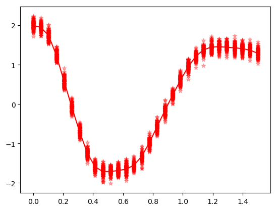
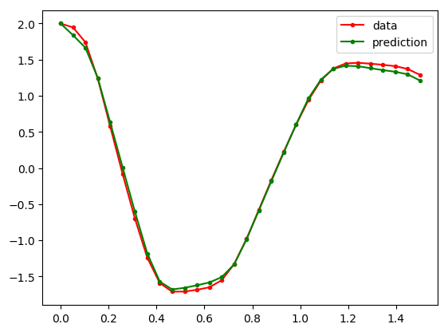
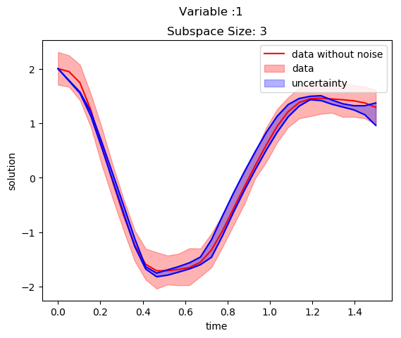

# Introduction


[Neural ODE’s](https://papers.nips.cc/paper/2018/hash/69386f6bb1dfed68692a24c8686939b9-Abstract.html) are introduced to model a system by combining machine learning and ODE’s together. This method is trying to model ODE representation of a system by using machine learning method instead of 

``
y = ML(x)
``
neural ODE's trying to model as
``
y^{'} = ML(x)
``

[DiffEqFlux.jl](https://github.com/SciML/DiffEqFlux.jl) package helps to implement Neural ODE's in Julia.

### Example of Neural ODE
This example is taken from [DiffEqFlux.jl Blog](https://julialang.org/blog/2019/01/fluxdiffeq/) and considers Lokta Voltera ODE's is used for the study and it is represented as:

``x^\prime = \alpha x + \beta x y``
``y^\prime = -\delta y + \gamma x y``

This ODE is solved using [DifferentialEquations.jl](https://github.com/SciML/DifferentialEquations.jl) package and the result is as shown below:

```julia
using DifferentialEquations

#ODE function
function lotka_volterra(du,u,p,t)
  x, y = u
  α, β, δ, γ = p
  du[1] = dx = α*x - β*x*y
  du[2] = dy = -δ*y + γ*x*y
end
#intial condition
u0 = [1.0,1.0]
#time span
tspan = (0.0,10.0)
p = [1.5,1.0,3.0,1.0]
prob = ODEProblem(lotka_volterra,u0,tspan,p)
#solving ODE
sol = solve(prob)
using Plots
#plot ODE solution
plot(sol)
```


Sometimes we won’t have exact knowledge of complete structure of non linear system to model using ODE’s. This case we  use Neural ODE’s to model the non linear system and to solve simply like training of Neural Network.

Neural ODE is discussed in this example with spiral ODE using [DiffEqFlux.jl](https://github.com/SciML/DiffEqFlux.jl) as below:

```julia
using DiffEqFlux
using Flux
using Flux: Data.DataLoader, @epochs
using DifferentialEquations, Plots
```
The inital conditions of spiral ODE is set as:

```julia
#intial condition
u0 = Float32[2.; 0.]
datasize = 30
#indipendent variable range
tspan = (0.0f0,1.5f0)
```
[DifferentialEquations.jl](https://github.com/SciML/DifferentialEquations.jl) package is used to solve the ODE equations and this solution is used as the training data for NeuralODE.

```julia
#ode function
function trueODEfunc(du,u,p,t)
    true_A = [-0.1 2.0; -2.0 -0.1]
    du .= ((u.^3)'true_A)'
end
#time span
t = range(tspan[1],tspan[2],length=datasize)
prob = ODEProblem(trueODEfunc,u0,tspan)
#spiral ODE solution
ode_data = Array(solve(prob,Tsit5(),saveat=t))
```
The neural network (NN) for neural ODE is defined with a cubical transformation function and two dense hidden layers. The NN has two inputs and two outputs and this NN is defined as:

```julia
dudt = Chain(x -> x.^3,
             Dense(2,50,tanh),
             Dense(50,2))
```
The neural ODE is incorporated with NN using `NeuralODE()` function as below:

```julia
n_ode = NeuralODE(dudt,tspan,Tsit5(),saveat=t,reltol=1e-7,abstol=1e-9)
ps = Flux.params(n_ode)
```
The prediction of ODE solution with randomly initialized network parameter is as shown below:

```julia
pred = n_ode(u0) # Get the prediction using the correct initial condition
scatter(t,ode_data[1,:],label="data")
scatter!(t,pred[1,:],label="prediction")
```
Above figure  illustrates the solution of neural ODE without training.


Now we can start training the Neural ODE. The function to predict is defined as:
```julia
#to predict solution from neural ODE
function predict_n_ode()
  n_ode(u0)
end
```
The sum squared error is used as the loss function and it is written as:
```julia
loss_n_ode() = sum(abs2,ode_data .- predict_n_ode())
```

The solution is repeated 1000 times to make training data as:
```julia
data = Iterators.repeated((), 1000)
```
The NN parameter optimization is implemented using `ADAM` optimizer.

```julia
opt = ADAM(0.1)
```
A callback function is defined to print loss during every epoch as:

```julia
cb = function () #callback function to observe training
  display(loss_n_ode())
  # plot current prediction against data
  cur_pred = predict_n_ode()
  pl = scatter(t,ode_data[1,:],label="data")
  scatter!(pl,t,cur_pred[1,:],label="prediction")
  display(plot(pl))
end
# Display the ODE with the initial parameter values.
cb()
```

The neural ODE is trained using `Flux.train!()` function as:
```julia
Flux.train!(loss_n_ode, ps, data, opt, cb = cb)
```
The solution from trained ODE is plotted as:
```julia
pred = n_ode(u0) # Get the prediction using the correct initial condition
scatter(t,ode_data[1,:],label="data")
scatter!(t,pred[1,:],label="prediction")
```
It is evident from the above figure that the predicted solution comes closer to actual solution. Therefore, it is a clear indication of proper training.


### Importance of subspace inference in Neural ODE?

The training of neural ODE’s provides slightly various parameters at different iterations. So, there will be an uncertainty in the solution using different neural ODE’s. Bayesian inference methods help to identify the uncertainties of the neural ODE parameters by using Markov Chain Monte Carlo (MCMC) or variational Inference (VI) samples. This Bayesian inference methods will be expensive when the number of parameters in the Neural ODE increases. [Subspace Inference](https://arxiv.org/abs/1907.07504) method is introduced to reduce time to calculate the uncertainties in neural ODE’s or Neural networks. [SubspaceInference.jl](https://github.com/efmanu/SubspaceInference.jl) is a Julia package developed for uncertainty analysis for Neural Networks and Neural ODE’s. This package supports `NUTS, RWMH and MALA` algorithm based Bayesian inferences.

The subspace inference analysis using [SubspaceInference.jl](https://github.com/efmanu/SubspaceInference.jl) is discussed with spiral ODE. This package can be installed as:

#### Install SubspaceInference package
```julia
using Pkg
Pkg.add("https://github.com/efmanu/SubspaceInference.jl")
```
Before defining the ODE, we have to use some packages for inference

```julia
using BSON: @save, @load;
using Zygote, SubspaceInference, DifferentialEquations;
using Flux, DiffEqFlux, PyPlot, Distributions;
using Flux: Data.DataLoader, @epochs;
```

We can define spiral ODE using [DifferentialEquations.jl](https://github.com/SciML/DifferentialEquations.jl). The spiral ODE consists of two dependent variable and the solution of ODE is calculated for independent variable `t` values from `0.0` to `1.5` with `datasize=30` data points.

```julia
#initial conditions and time span
len = 100

#intial conditions
u0 = Array{Float64}(undef,2,len)
u0 .= [2.; 0.]
#datasize in solution
datasize = 30
tspan = (0.0,1.5)

#ode function
function trueODEfunc(du,u,p,t)
    true_A = [-0.1 2.0; -2.0 -0.1]
    du .= ((u.^3)'true_A)'
end

#time points
t = range(tspan[1],tspan[2],length=datasize)
```
The ODE is solved to generate the training data. In this example, ODE output variables and the solutions is  for `30` data points. This solution is converted to a vector and it is used to fill `ode_data` matrix with `len=100` columns. This matrix data will added with a noise of `Normal(0.0, 0.1)` and used to train the neural ODE.

```julia
ode_data = Array{Float64}(undef, 2*datasize, len)
for i in 1:len
	prob = ODEProblem(trueODEfunc,u0[:,i],tspan)
	ode_data[:,i] = reshape(Array(solve(prob,Tsit5(),saveat=t))', :, 1)
end
ode_data_bkp = ode_data
ode_data += rand(Normal(0.0,0.1), 2*datasize,len);
```
The following code is used to plot the ODE solution with noise.
```julia
(fig, f_axes) = PyPlot.subplots(ncols=1, nrows=1)
for i in 1:len
	f_axes.scatter(t,vec(ode_data[1:1:datasize,i]), c="red", alpha=0.3, marker="*", label ="data with noise")
end
f_axes.plot(t,vec(ode_data_bkp[1:1:datasize,1]), c="red", marker=".", label = "data")
fig.show();
```
Above figure illustrates  the different solutions for spiral ODE.



The subspace inference methods use pretrained neural ODE and it is set up and trained as below:

```julia
dudt = Chain(x -> x.^3, Dense(2,15,tanh),
             Dense(15,2))
n_ode = NeuralODE(dudt,tspan,Tsit5(),saveat=t,
	reltol=1e-7,abstol=1e-9);

ps = Flux.params(n_ode);

sqnorm(x) = sum(abs2, x)
L1(x, y) = sum(abs2, n_ode(vec(x)) .- 
	reshape(y[:,1], :,2)')+sum(sqnorm, Flux.params(n_ode))/100
#call back
cb = function () #callback function to observe training
  @show L1(u0[:,1], ode_data_bkp[:,1])
end

#optiizer
opt = ADAM(0.1);

#format data
X = u0 #input
Y =ode_data #output 

data =  DataLoader(X,Y);

@epochs 4 Flux.train!(L1, ps, data, opt);
cb();
```
The solution of ODE with pretrained network is shown in the below figure:

```julia
(fig, f_axes) = PyPlot.subplots(ncols=1, nrows=1)
pred = n_ode(vec(u0[:,1])) # Get the prediction using the correct initial condition
f_axes.plot(t,vec(ode_data_bkp[1:datasize,1]), c="red", marker=".", label = "data")
f_axes.plot(t,vec(pred[1,:]), c="green", marker=".", label ="prediction")
f_axes.legend()
fig.show()
```





### Subspace Inference for Neural ODE

We have to modify the loss function for subspace construction because this algorithm updates weight parameters every time and calculate the loss.


```julia
L1(m, x, y) = sum(abs2, m(vec(x)) .- reshape(y[:,1], :,2)')+sum(sqnorm, Flux.params(m))/100;
```
The subspace inference is generated for subspace size of `3` with `100` iterations as below. This algorithm generates uncertainties using MH algorithm with subspace with proposal distribution of `0.1`. During inference, the posterior samples of subspace is generated by considering the prior distribution of neural network parameters.


```julia
T = 1
M = 3
itr = 100
σ_z = 0.1 #proposal distribution

#do subspace inference
chn, lp, W_swa = SubspaceInference.subspace_inference(n_ode, L1, data, opt;
	σ_z = σ_z, itr =itr, T=T, M=M,  alg =:mh);

ns = length(chn)

trajectories = Array{Float64}(undef,2*datasize,ns)
for i in 1:ns
  new_model = SubspaceInference.model_re(n_ode, chn[i])
  out = new_model(u0[:,1])
  reshape(Array(out)',:,1)
  trajectories[:, i] = reshape(Array(out)',:,1)
end

all_trajectories = Dict()
all_trajectories[1] = trajectories
title = ["Subspace Size: $M"]

SubspaceInference.plot_node(t, all_trajectories, ode_data_bkp, ode_data, 2, datasize, title)
```
The uncertainties in solution is plotted for two variables in the below two figures. The blue color shaded area is corresponds to generated uncertainty information and red shaded area corresponds to the noise in the trained data.




The plot of variable 1 against variable 2 for subspace of 3 with 1.0 proposal distribution is Illustrated  in the below figure. 


The below figure discuss the uncertainties in predictions as well as in forecasting.


### Effect of different subspace sizes in neural ODE uncertainty generation
This experiment focuses on the uncertainty outcomes due to different proposal standard deviations, `σ_z`. This simulation considers proposal deviations of `0.1` and `1.0` and following code is used:

```julia
T = 1
M = [3,5,10,15]
itr = 100
σ_z = 0.1
alg = :hmc
all_trajectories = Dict()
for ti in 1:4
  @load "n_ode_weights_30r.bson" ps;
  Flux.loadparams!(n_ode, ps);

  #do subspace inference
  chn, lp, W_swa = SubspaceInference.subspace_inference(n_ode, L1, data, opt;
    σ_z = σ_z, itr =itr, T=T, M=M[ti],  alg =alg);

  ns = length(chn)

  trajectories = Array{Float64}(undef,2*datasize,ns)
  for i in 1:ns
    new_model = SubspaceInference.model_re(n_ode, chn[i])
    out = new_model(u0[:,1])
    reshape(Array(out)',:,1)
    trajectories[:, i] = reshape(Array(out)',:,1)
  end
  
  all_trajectories[ti] = trajectories
end
title = ["Subspace Size:3","Subspace Size:5","Subspace Size:10","Subspace Size:15"]

SubspaceInference.plot_node(t, all_trajectories, ode_data_bkp, ode_data, 2, datasize, title)
```


It is evident from abve figures that the uncertainty information decreases with increase in subspace sizes. Moreover, the current parameters used for the experiment is not enough to cover the complete data uncertainty.

### Effect of different proposal distributions in neural ODE uncertainty generation


```julia
T = 1
M = 5
itr = 100
σ_z = [0.1, 1.0]
alg = :hmc
all_trajectories = Dict()
for ti in 1:4
  @load "n_ode_weights_30r.bson" ps;
  Flux.loadparams!(n_ode, ps);

  #do subspace inference
  chn, lp, W_swa = SubspaceInference.subspace_inference(n_ode, L1, data, opt;
    σ_z = σ_z[ti], itr =itr, T=T, M=M,  alg =alg);

  ns = length(chn)

  trajectories = Array{Float64}(undef,2*datasize,ns)
  for i in 1:ns
    new_model = SubspaceInference.model_re(n_ode, chn[i])
    out = new_model(u0[:,1])
    reshape(Array(out)',:,1)
    trajectories[:, i] = reshape(Array(out)',:,1)
  end
  
  all_trajectories[ti] = trajectories
end
title = ["Std: 0.1","Std: 1.0"]

SubspaceInference.plot_node(t, all_trajectories, ode_data_bkp, ode_data, 2, datasize, title)
```


It is noticeable from the above figures that the uncertainty information for proposal standard deviation `1.0` is too high compared to standard deviation of `0.1`. 


